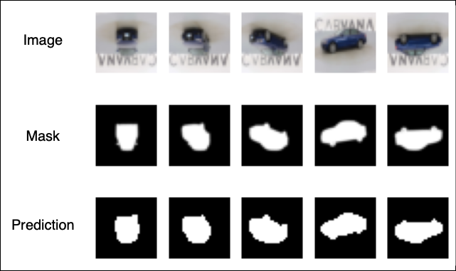

# Carvana UNet Segmentation

This project implements a UNet-based image segmentation pipeline for the Carvana dataset using PyTorch. The goal is to segment car masks from images.



## Folder Structure

- `my_carvana_demo/`
  - `custom_dataset.py`: Custom PyTorch dataset for loading images and masks.
  - `model_main.py`: UNet model definition.
  - `model_parts.py`: Building blocks for UNet (DoubleConv, DownSample, UpSample).
  - `train_val.py`: Training and validation script.
  - `train_val.ipynb`: Jupyter notebook for training, validation, and inference visualization.
  - `models/unet.pth`: Saved model weights.
  - `figureout.png`: Example output visualization.
- `data/`
  - `train/`: Training images.
  - `train_masks/`: Training masks.
  - `manual_test/`: Test images.
  - `manual_test_masks/`: Test masks.

## Getting Started

### Requirements

- Python 3.8+
- PyTorch
- torchvision
- matplotlib
- tqdm
- Pillow

Install dependencies:

```sh
pip install torch torchvision matplotlib tqdm pillow
```

### Training

Run the training script:

```sh
python train_val.py
```

This will train the UNet model and save weights to `models/unet.pth`.

### Inference & Visualization

Use `train_val.ipynb` to run inference and visualize results. The notebook will generate a figure showing input images, ground truth masks, and predicted masks.

### Custom Dataset

The [`CustomDataset`](my_carvana_demo/custom_dataset.py) class loads images and masks, applies transforms, and performs random flips for augmentation.

### Model

The [`Unet`](my_carvana_demo/model_main.py) model is built from modular parts in [`model_parts.py`](my_carvana_demo/model_parts.py).

## Example Output

See `figureout.png` for sample predictions.

## References

- [UNet Paper](https://arxiv.org/abs/1505.04597)
- [Carvana Image Masking Challenge](https://www.kaggle.com/c/carvana-image-masking-challenge)
